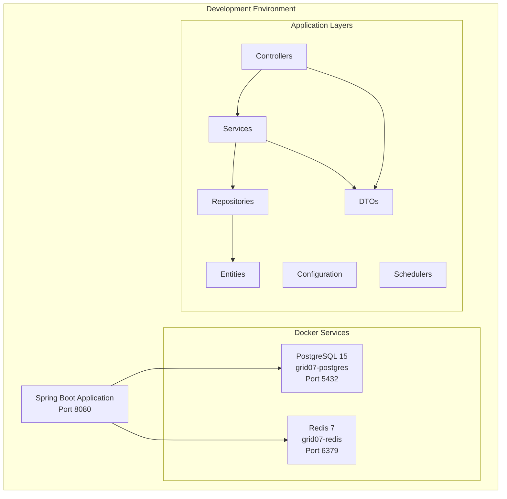

# Design Document

## Overview

This design document outlines the technical implementation for setting up a Spring Boot 3 application with Docker infrastructure, including PostgreSQL 15 and Redis 7 services. The system provides a complete development environment with proper configuration, package structure, and dependency management for immediate development use.

The solution consists of:
- Docker Compose configuration for PostgreSQL and Redis services
- Spring Boot application configuration for database and cache connectivity
- Organized package structure following Spring Boot best practices
- Maven dependency management for required libraries
- Git repository setup with appropriate ignore patterns

## Architecture

### System Components



### Component Interactions

1. **Spring Boot Application**: Main application server running on port 8080
2. **PostgreSQL Database**: Primary data persistence layer with JPA/Hibernate integration
3. **Redis Cache**: Caching and session management layer
4. **Package Structure**: Organized layers following Spring Boot conventions

## Components and Interfaces

### Docker Infrastructure

#### PostgreSQL Service Configuration
- **Container Name**: `grid07-postgres`
- **Image**: `postgres:15`
- **Database**: `grid07db`
- **Username**: `grid07user`
- **Password**: `grid07pass`
- **Port Mapping**: `5432:5432`
- **Volume**: Persistent data storage for database files

#### Redis Service Configuration
- **Container Name**: `grid07-redis`
- **Image**: `redis:7`
- **Port Mapping**: `6379:6379`
- **Configuration**: Default Redis configuration with persistence enabled

### Spring Boot Configuration

#### Database Configuration
```properties
spring.datasource.url=jdbc:postgresql://localhost:5432/grid07db
spring.datasource.username=grid07user
spring.datasource.password=grid07pass
spring.datasource.driver-class-name=org.postgresql.Driver

spring.jpa.hibernate.ddl-auto=update
spring.jpa.show-sql=true
spring.jpa.properties.hibernate.dialect=org.hibernate.dialect.PostgreSQLDialect
```

#### Redis Configuration
```properties
spring.data.redis.host=localhost
spring.data.redis.port=6379
spring.data.redis.timeout=2000ms
```

#### Application Configuration
```properties
spring.application.name=backend
server.port=8080
spring.task.scheduling.enabled=true
```

### Package Structure Organization

The application follows a layered architecture with clear separation of concerns:

```
com.grid07.backend/
├── config/          # Configuration classes
├── controller/      # REST controllers
├── service/         # Business logic services
├── repository/      # Data access layer
├── entity/          # JPA entities
├── dto/            # Data Transfer Objects
├── constants/      # Application constants
└── scheduler/      # Scheduled tasks
```

#### Package Responsibilities

1. **config**: Spring configuration classes, beans, and application setup
2. **controller**: REST API endpoints and request handling
3. **service**: Business logic implementation and transaction management
4. **repository**: Data access interfaces extending JPA repositories
5. **entity**: JPA entity classes representing database tables
6. **dto**: Data transfer objects for API requests/responses
7. **constants**: Application-wide constants and enumerations
8. **scheduler**: Scheduled task implementations

## Data Models

### Database Schema Management
- **Schema Creation**: Automatic via Hibernate DDL with `spring.jpa.hibernate.ddl-auto=update`
- **Entity Mapping**: JPA annotations for table and column mapping
- **Relationship Management**: JPA relationship annotations (@OneToMany, @ManyToOne, etc.)

### Redis Data Structure
- **Key-Value Storage**: Simple caching with TTL support
- **Session Management**: Spring Session integration for user sessions
- **Serialization**: JSON serialization for complex objects

### Configuration Properties Structure
```yaml
# Database Configuration
spring:
  datasource:
    url: jdbc:postgresql://localhost:5432/grid07db
    username: grid07user
    password: grid07pass
  
  # JPA Configuration
  jpa:
    hibernate:
      ddl-auto: update
    show-sql: true
  
  # Redis Configuration
  data:
    redis:
      host: localhost
      port: 6379
  
  # Application Configuration
  application:
    name: backend
  task:
    scheduling:
      enabled: true

# Server Configuration
server:
  port: 8080
```

## Error Handling

### Database Connection Errors
- **Connection Timeout**: Implement connection pooling with HikariCP
- **Database Unavailable**: Graceful degradation with health checks
- **Transaction Failures**: Proper rollback mechanisms with @Transactional

### Redis Connection Errors
- **Cache Miss Handling**: Fallback to database when Redis is unavailable
- **Connection Pool Management**: Lettuce connection pooling configuration
- **Serialization Errors**: Proper exception handling for cache operations

### Application Startup Errors
- **Dependency Resolution**: Clear error messages for missing dependencies
- **Configuration Validation**: Validation of required properties at startup
- **Port Conflicts**: Clear messaging when port 8080 is already in use

## Testing Strategy

This feature involves Infrastructure as Code (Docker Compose), configuration setup, and project scaffolding. Property-based testing is not appropriate for this type of infrastructure and configuration work. Instead, the testing strategy focuses on:

### Integration Testing
- **Docker Service Connectivity**: Verify PostgreSQL and Redis containers start successfully
- **Database Connection**: Test Spring Boot application connects to PostgreSQL
- **Cache Connection**: Test Spring Boot application connects to Redis
- **Application Startup**: Verify application starts without errors on port 8080

### Configuration Testing
- **Property Loading**: Verify all configuration properties are loaded correctly
- **Bean Creation**: Test that all Spring beans are created successfully
- **Health Checks**: Implement and test actuator health endpoints

### Smoke Testing
- **Docker Compose**: `docker-compose up -d` starts all services
- **Maven Build**: `mvn compile` resolves all dependencies successfully
- **Application Launch**: `mvn spring-boot:run` starts application without errors
- **Git Repository**: Repository initialization and initial commit

### Example Test Scenarios
1. **Service Startup Test**: Start Docker services and verify connectivity
2. **Configuration Validation Test**: Load application with various property configurations
3. **Dependency Resolution Test**: Verify all Maven dependencies resolve correctly
4. **Package Structure Test**: Verify all required packages exist with proper structure

The testing approach emphasizes practical verification of the development environment setup rather than algorithmic correctness, making integration and smoke tests the most appropriate testing strategies for this infrastructure-focused feature.

## Implementation Approach

### Phase 1: Docker Infrastructure Setup

#### Docker Compose Configuration
Create `docker-compose.yml` in the project root with the following structure:

```yaml
version: '3.8'
services:
  grid07-postgres:
    image: postgres:15
    container_name: grid07-postgres
    environment:
      POSTGRES_DB: grid07db
      POSTGRES_USER: grid07user
      POSTGRES_PASSWORD: grid07pass
    ports:
      - "5432:5432"
    volumes:
      - postgres_data:/var/lib/postgresql/data
    restart: unless-stopped

  grid07-redis:
    image: redis:7
    container_name: grid07-redis
    ports:
      - "6379:6379"
    volumes:
      - redis_data:/data
    restart: unless-stopped

volumes:
  postgres_data:
  redis_data:
```

#### Service Health Verification
- Implement health check endpoints using Spring Boot Actuator
- Add database and Redis connectivity checks
- Configure startup dependencies to ensure services are ready

### Phase 2: Spring Boot Configuration

#### Application Properties Enhancement
Update `backend/src/main/resources/application.properties`:

```properties
# Application Configuration
spring.application.name=backend
server.port=8080

# Database Configuration
spring.datasource.url=jdbc:postgresql://localhost:5432/grid07db
spring.datasource.username=grid07user
spring.datasource.password=grid07pass
spring.datasource.driver-class-name=org.postgresql.Driver

# JPA/Hibernate Configuration
spring.jpa.hibernate.ddl-auto=update
spring.jpa.show-sql=true
spring.jpa.properties.hibernate.dialect=org.hibernate.dialect.PostgreSQLDialect
spring.jpa.properties.hibernate.format_sql=true

# Redis Configuration
spring.data.redis.host=localhost
spring.data.redis.port=6379
spring.data.redis.timeout=2000ms

# Task Scheduling
spring.task.scheduling.enabled=true

# Actuator Configuration
management.endpoints.web.exposure.include=health,info
management.endpoint.health.show-details=always
```

#### Configuration Classes
Create configuration classes in the `config` package:

1. **DatabaseConfig**: Custom database configuration if needed
2. **RedisConfig**: Redis template and connection factory configuration
3. **SchedulingConfig**: Task scheduling configuration

### Phase 3: Package Structure Implementation

#### Directory Creation Strategy
Create the following package structure under `backend/src/main/java/com/grid07/backend/`:

```
config/
├── DatabaseConfig.java (optional)
├── RedisConfig.java
└── SchedulingConfig.java

controller/
└── .gitkeep (placeholder until controllers are added)

service/
└── .gitkeep (placeholder until services are added)

repository/
└── .gitkeep (placeholder until repositories are added)

entity/
└── .gitkeep (placeholder until entities are added)

dto/
└── .gitkeep (placeholder until DTOs are added)

constants/
└── ApplicationConstants.java (basic constants class)

scheduler/
└── .gitkeep (placeholder until schedulers are added)
```

#### Placeholder Classes
For packages that need immediate structure, create minimal placeholder classes:

```java
// constants/ApplicationConstants.java
package com.grid07.backend.constants;

public final class ApplicationConstants {
    private ApplicationConstants() {
        // Utility class
    }
    
    // Add application constants here
}
```

### Phase 4: Maven Dependencies Verification

#### Dependency Analysis
The current `pom.xml` already includes most required dependencies:
- ✅ Spring Web (via spring-boot-starter-webmvc)
- ✅ Spring Data JPA
- ✅ Spring Data Redis
- ✅ PostgreSQL Driver
- ✅ Lombok
- ✅ Validation

#### Missing Dependencies
Add Spring Boot Actuator for health checks:

```xml
<dependency>
    <groupId>org.springframework.boot</groupId>
    <artifactId>spring-boot-starter-actuator</artifactId>
</dependency>
```

### Phase 5: Git Repository Configuration

#### .gitignore Enhancement
Ensure the `.gitignore` file includes:

```gitignore
# Maven
target/
!.mvn/wrapper/maven-wrapper.jar
!**/src/main/**/target/
!**/src/test/**/target/

# IDE
.idea/
*.iws
*.iml
*.ipr
.vscode/

# OS
.DS_Store
Thumbs.db

# Logs
*.log

# Docker
.env
```

#### Initial Commit Strategy
1. Initialize Git repository if not already done
2. Add all configuration files
3. Commit with message: "chore: project bootstrap with docker-compose and config"

## Technical Considerations

### Development Workflow
1. **Service Startup Order**: Start Docker services before Spring Boot application
2. **Port Management**: Ensure ports 5432, 6379, and 8080 are available
3. **Data Persistence**: Docker volumes ensure data survives container restarts

### Performance Considerations
- **Connection Pooling**: HikariCP for database connections (default in Spring Boot)
- **Redis Connection Pool**: Lettuce driver provides connection pooling
- **JVM Configuration**: Consider memory settings for development environment

### Security Considerations
- **Database Credentials**: Use environment variables in production
- **Redis Security**: Consider password protection for production use
- **Network Security**: Docker services exposed only on localhost for development

### Scalability Considerations
- **Database Scaling**: PostgreSQL supports read replicas and partitioning
- **Cache Scaling**: Redis supports clustering and replication
- **Application Scaling**: Spring Boot supports horizontal scaling with load balancers

## Deployment Considerations

### Development Environment
- Docker Compose for local development
- Hot reload with Spring Boot DevTools
- Database schema evolution with Hibernate DDL

### Production Readiness
- Environment-specific configuration profiles
- External configuration management
- Health monitoring and logging
- Database migration strategy with Flyway or Liquibase

## Monitoring and Observability

### Health Checks
- Spring Boot Actuator endpoints
- Database connectivity monitoring
- Redis connectivity monitoring
- Custom health indicators for business logic

### Logging Strategy
- Structured logging with Logback
- Database query logging (development only)
- Application performance monitoring
- Error tracking and alerting

## Maintenance and Updates

### Dependency Management
- Regular updates of Spring Boot version
- Security patches for PostgreSQL and Redis
- Maven dependency vulnerability scanning

### Database Maintenance
- Regular backup strategies
- Index optimization
- Query performance monitoring
- Schema migration planning

### Cache Management
- Redis memory usage monitoring
- Cache hit ratio optimization
- TTL strategy for cached data
- Cache invalidation patterns